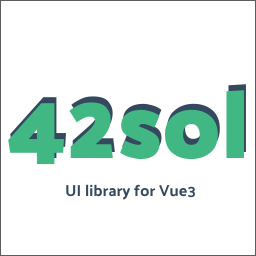

# @42sol/vue3-ui



Library of components for Vue3 and TypeScript.

## Installation

You can install this library using npm:

```bash
npm install @42sol/vue3-ui
#or
yarn add @42sol/vue3-ui

```

## Usage

To use the components from this library, you need to import them from the corresponding files. For example:

```js
import { MyComponent } from '@42sol/vue3-ui';

```

Then, you can use the components in your application's templates:

```html
<template>
  <div>
    <RouterTabs></RouterTabs>
  </div>
</template>

```

## Available Components

Below are the available components in this library:

- `router-tab`: description of the component.

## License

This project is licensed under the MIT License. See the `LICENSE` file for details.